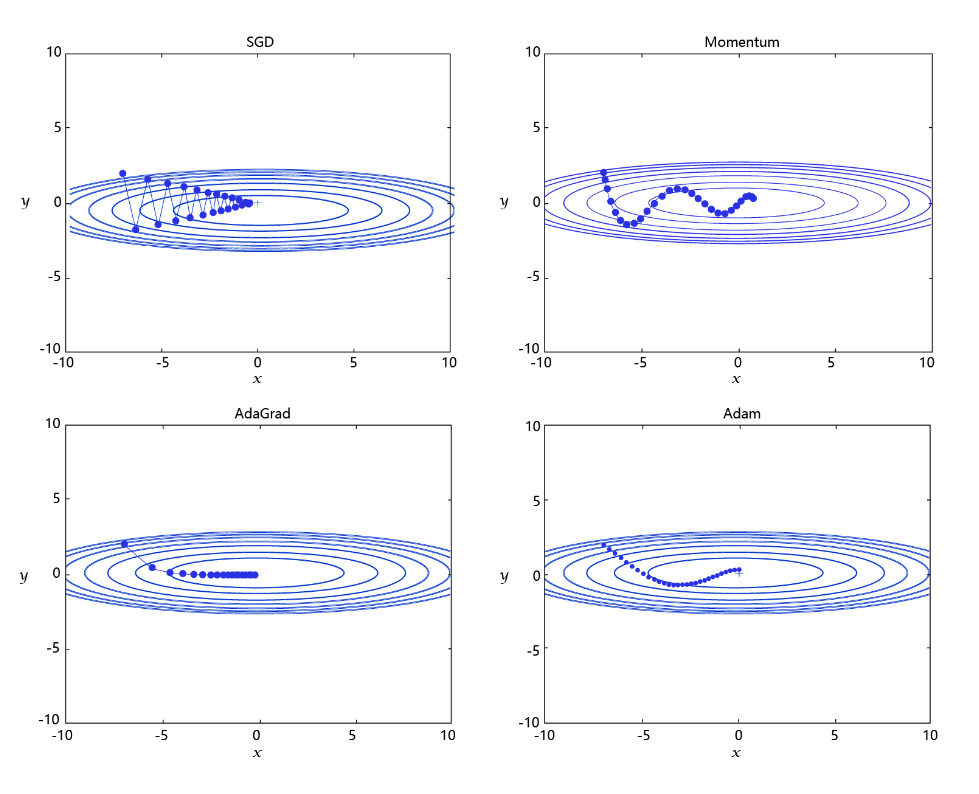

# 学习率的主流优化算法
学习率是优化器的一个参数，调整学习率看似是一件非常麻烦的事情，需要不断的调整步长，观察训练时间和Loss的变化。经过研究员的不断的实验，当前已经形成了四种比较成熟的优化算法：SGD、Momentum、AdaGrad和Adam，效果如图所示。

- [SGD](https://www.paddlepaddle.org.cn/documentation/docs/zh/api/paddle/optimizer/SGD_cn.html#sgd): 随机梯度下降算法，每次训练少量数据，抽样偏差导致的参数收敛过程中震荡。     
- [Momentum](https://www.paddlepaddle.org.cn/documentation/docs/zh/api/paddle/optimizer/Momentum_cn.html#momentum): 引入物理“动量”的概念，累积速度，减少震荡，使参数更新的方向更稳定。      
> 每个批次的数据含有抽样误差，导致梯度更新的方向波动较大。如果我们引入物理动量的概念，给梯度下降的过程加入一定的“惯性”累积，就可以减少更新路径上的震荡，即每次更新的梯度由“历史多次梯度的累积方向”和“当次梯度”加权相加得到。历史多次梯度的累积方向往往是从全局视角更正确的方向，这与“惯性”的物理概念很像，也是为何其起名为“Momentum”的原因。类似不同品牌和材质的篮球有一定的重量差别，街头篮球队中的投手（擅长中远距离投篮）喜欢稍重篮球的比例较高。一个很重要的原因是，重的篮球惯性大，更不容易受到手势的小幅变形或风吹的影响。        
- [AdaGrad](https://www.paddlepaddle.org.cn/documentation/docs/zh/api/paddle/optimizer/Adagrad_cn.html#adagrad): 根据不同参数距离最优解的远近，动态调整学习率。学习率逐渐下降，依据各参数变化大小调整学习率。       
> 通过调整学习率的实验可以发现：当某个参数的现值距离最优解较远时（表现为梯度的绝对值较大），我们期望参数更新的步长大一些，以便更快收敛到最优解。当某个参数的现值距离最优解较近时（表现为梯度的绝对值较小），我们期望参数的更新步长小一些，以便更精细的逼近最优解。类似于打高尔夫球，专业运动员第一杆开球时，通常会大力打一个远球，让球尽量落在洞口附近。当第二杆面对离洞口较近的球时，他会更轻柔而细致的推杆，避免将球打飞。与此类似，参数更新的步长应该随着优化过程逐渐减少，减少的程度与当前梯度的大小有关。根据这个思想编写的优化算法称为“AdaGrad”，Ada是Adaptive的缩写，表示“适应环境而变化”的意思。[RMSProp](https://www.paddlepaddle.org.cn/documentation/docs/zh/api/paddle/optimizer/RMSProp_cn.html#rmsprop)是在AdaGrad基础上的改进，学习率随着梯度变化而适应，解决AdaGrad学习率急剧下降的问题。     
- [Adam](https://www.paddlepaddle.org.cn/documentation/docs/zh/api/paddle/optimizer/Adam_cn.html#adam): 由于动量和自适应学习率两个优化思路是正交的，因此可以将两个思路结合起来，**这就是当前广泛应用的算法**。