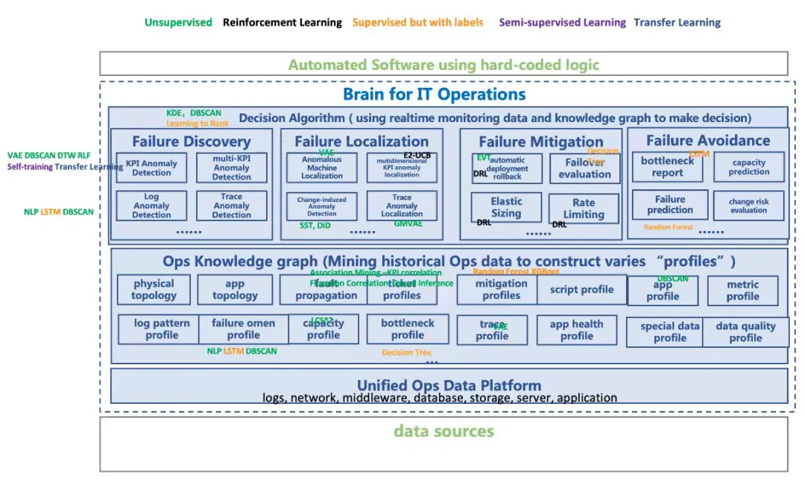
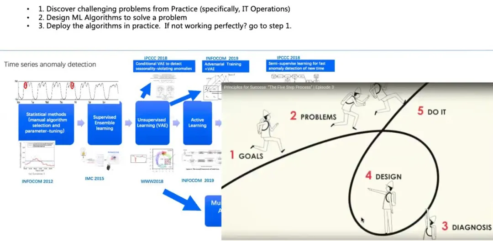

# AIOps实践心得
清华大学裴丹教授，华为开发者大会2021: https://mp.weixin.qq.com/s/fhrsJQlJTuVESenYrTLL5Q

## AIOps分而治之，而非使用“黑盒”通用算法解决运维难题
人工智能技术在快速发展，但是目前的能力有限。正如清华大学计算机系张钹院士所说:“**当前AI技术能够较好解决的一类问题，必须同时满足五个条件，即充足的数据和知识、确定性、完全信息、静态和有限领域**。”

在AIOps领域，第一点经验就是解决复杂的智能运维问题不能使用黑盒方法，而是要对问题进行“庖丁解牛”式的架构拆解，将其拆解成不同的模块。有的模块可以通过监控方法、自动化方法或者已有的运维算法得到有效解决；有的模块虽然没有既定方法，但处于可控范围内。通过这样的架构拆解方式，能够有效解决复杂而具体的运维场景中遇到的各种挑战。这与张钹院士提出的 AI 3.0“**知识驱动+数据驱动+算法+算力**”的理念是一致的，我们在实际工作中也是这样践行的。

## AIOps拥有广泛的AI算法，要具体问题具体分析

## 算法研究要紧密结合实践

## 尽量减少数据标注
**算法选择的优先级：**      
1. Unsupervised approaches      
2. Unsupervised approaches + active learning(whitelisting)      
3. Semi-supervised approaches; supervised approaches+transfer learning      
4. Supervised approaches

我们做智能运维算法时，首选能使用无监督方法就使用无监督方法，在无监督方法效果不理想时，再加入主动学习，让人工对效果不理想的部分做进一步反馈，用于指导、调整无监督算法里面的参数；其次，使用半监督学习方法，比如有监督学习+迁移学习、无监督学习+迁移学习等；最后，使用有监督学习方法，不过由于标注很少且很难获得标注，整体效果并不好。

## 尽可能使用多模态数据
解决真实事件问题，不能只看指标、日志或者调用链，而是尽量使用多模态数据，因为数据特征越丰富，智能运维的结果就会越明显。在这个过程中，需要根据“知识+数据”双轮驱动中的“知识”对多模态数据进行有效关联，实现“上帝视角”，避免“盲人摸象”的效果。这里说的“知识”可能来自一部分数据，比如拓扑、调用链；也可能来自于经验，基于IT 架构挖掘出来的因果关系。

