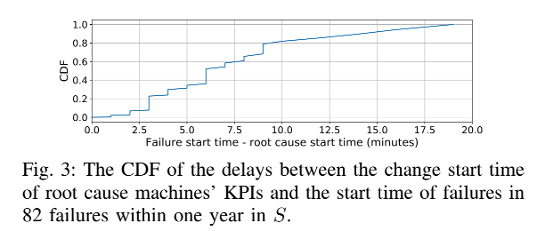
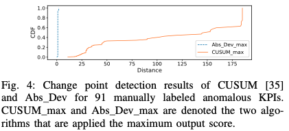
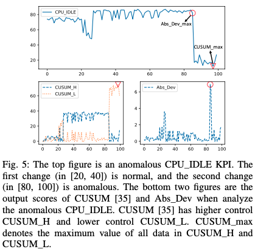
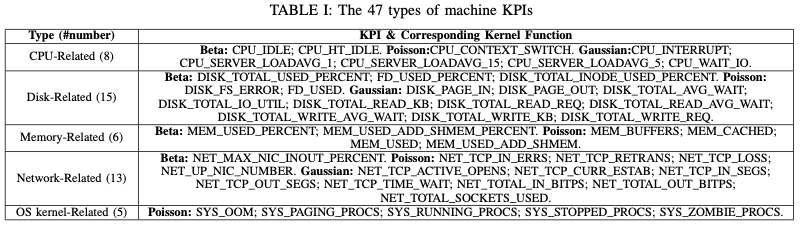

# FluxRank:一种适用于广泛部署的自动RCA框架
[点击下载原始论文](./FluxRank-paper.pdf)

索引关键词: KPI, 故障诊断, 故障定位

**本文侧重的是定位错误发生的地方，以便可以执行缓解故障的操作，不是确切的根因分析。**

FluxRank使用来自顶级搜索公司的五个真实服务（具有成千上万台计算机）的历史案例进行评估，结果表明，在70例案例中，有55（66）例的根本原因机器排名第一（前三）。 与现有方法相比，FluxRank平均将本地化时间减少了80％以上。 FluxRank已在一个Internet服务和六个Banking服务上在线部署了三个月，并且正确地将根本原因机器本地化为59例中55例中的前1例。

## 1. Introduction
实践中处理系统异常分为三步：  
1. failure confirmation: 故障确认   
2. mitigation: 故障处理  
3. Root Cause Analysis: 根因分析  

在执行错误缓解系统问题之前是很难也没有必要确定系统的根因的，这是由于以下两个原因：1. 在执行缓解措施的时候，运维人员是没有确定service问题根因的必要信息的；2. 对于现在的K8S或者Mesos构架来说，单单通过机器KPI的变化所指示的机器故障足以决策如何采取缓解措施。
### A. 现有方法的缺陷
大多数的RCA都是通过构架图来进行的。一些研究通过网络拓扑图来定位计算机网络的根因。然而软件服务的依赖图并不能像网络拓扑图那样推理出来。 Sherlock(P. Bahl, R. Chandra, A. Greenberg, S. Kandula, D. A. Maltz, and M. Zhang, “Towards highly reliable enterprise network services via inference of multi-level dependencies,” in ACM SIGCOMM Computer Communication Review, vol. 37, no. 4. ACM, 2007, pp. 13–24.)在每个host部署agent来推理依赖图，通过相同clients和夸不同的clients的logs的关联关系分析来定位根因。

- **MonitorRank**使用trace logs来构建依赖图，然后使用random walk算法来定位根因。  
- **CauseInfer**使用wire-captured service calls来构架服务依赖图，应用PC-algorithm来构建一个度量因果图(metric causality graph)，然后在两个级别的图上定位根因。  
- **FChain**是同Sherlock方法构架依赖图      
- **BRCA**基于服务的历史KPI异常告警来挖掘依赖图        

由于难以收集上面提到的其他必要数据，因此这些方法所需的依赖图通常在实践中很难获得。 此外，为快速变化的软件服务（尤其是在敏捷和DevOps理念下开发的软件服务）维护图形也非常具有挑战性。 代码的快速更改使依赖关系图变得难以捉摸。 结果，上述方法的应用面临很多局限性，而实际的根本原因定位仍然主要是人工，费时费力。

### B. 核心思想
使用机器学成的方法解决现实世界中的故障问题是有希望的，特别是现在的系统有许多的监控数据。然而在端到端的方法中直接使用监控数据训练机器学习模型通常效果并不好，这是因为：  
1. 没有很好的定义问题   
2. 不完整的信息     
3. 错误case不足     
4. 缺乏可解释性     

FluxRank的核心高级思想是利用领域知识（通常不会在数据中捕获或学习，但可以通过手动故障排除过程进行抽象或模仿）来设计系统, 其中每个组件都有一个定义明确的问题，足够的数据和可解释的算法的体系结构。 这样，在故障排除中看似无法解决的端到端机器学习问题就可以通过领域知识启发的体系结构解决。   

因此，FluxRank的idea是受到百度的5步故障处理大法的启发的：   
1. 在后台，运维人员使用一些在线统计算法来检测大量的服务和设备KPI的异常      
2. 当一个service失败后，运维人员可以手动搜索一下设备KPI，看看服务失败的时刻附近哪些KPI变异常了和出故障的设备   
3. 然后运维人员根据运维经验手动对故障设备潜在的组合进行排名     
4. 运维人员手动在排名较高的设备组合上依次触发自动化动作（将流量切离故障设备或重启故障设备）     
5. 当故障处理成功后（after a successful mitigation）， 开发工程师（非运维人员）将花时间分析代码和logs，以找到和修复最终的根因(root cause)       

在上述方法中，只需要定位根因设备并将其从服务中异常就可以缓解故障，对于采用分布式集群的高可用架构来说，这个优势非常明显。

然而上述方法中，第一步是低效的、不准确的，第二步和第三步是手动的，因此故障恢复花费的时间太长。**作者分析了一个服务（运行在11519台设备上的29个模块）9个月的8起使用上述方法进行故障修复的记录，最大的修复时间是175分钟，平均59分钟。**

受到上述实践的启发并意识到上述方法的低效性，本文提出了一个通用系统**FluxRank**，可以更具给定的软件无法失败信息自动定位根因设备。FluxRank使用同样的设备KPIs指标数据(几乎所有的软件服务中都是使用这些数据的），并且效仿上述方法的前三个步骤，但是让每个步骤高效(efficient)、准确(accurate)和自动(automatic)，从而大大减少故障恢复的时间。

FluxRank是通过服务失败触发的（KPI异常检测不属于本文的探讨范围）。**FluxRank的输入包括：服务故障时刻和所有的设备KPI数据。FluxRank有三个阶段：change quantification，digest distillation，digest ranking**。**首先,**在*change quantification*阶段所有的设备KPIs指标被量化；**第二,**在*digest distillation*阶段，所有的KPI通过聚类算法分类为*digest*，每个*digest*都包含了来自于同一模块的一组设备和代表模块异常模式的一组KPI。**第三,**所有的*digest*更具在*digest ranked*阶段的潜在根因定位自动排名。**最后,**基于digest排序的结果，运维人员通过触发一些自动化动作进行故障缓解。*change quantification*模仿了步骤2中的手动处理过程，*digest distillation*和*digest ranking*模仿了第三步。

### C. 挑战和贡献
#### 挑战1：如何快速量化服务故障时间内大量不同的KPI变化？
虽然这些年已经提出了许多异常检测算法，每个被监控的KPI需要单独进行算法选择和调参。当KPI的数量达、种类多的时候，谨慎的进行算法选择和参数优化变得不可行，导致异常检测的结果不准确，在step2和step3中遇到更多的困难。但是，不同于在任何时候都可能发生异常的一般异常检测方案，在我们的方案中已经给出了服务故障时间，我们只需要开发一种算法即可量化服务故障时间附近机器KPI的变化。 剩下的挑战是该算法必须具有灵活性以在各种KPI上工作，并且必须足够轻巧和快速，以便能够快速分析大量KPI。

#### 挑战2：如何对具有物理意义的KPI进行聚类？
一个模块中的故障可以传播到其他模块，并且故障机器可能同时具有多个异常的KPI。 结果，一个服务故障通常与许多机器KPI异常同时发生。 运维人员经常会根据他们的领域知识以临时的方式总结机器的KPI异常。 我们的挑战是以一种对运维人员来说很直观的方式来确定缓解措施，从而在相关机器/模块上自动，系统地将具有相似异常程度的KPI聚类。

#### 挑战3：如何对聚类结果进行排序？
对于大型软件服务，通常在计设备别经常存在并发但不相关的异常情况。 这意味着，对于服务故障，第2阶段以上可能会输出多个聚类结果。 因此，在阶段3中，我们必须对阶段2中的聚类结果进行排名，以便与故障最相关的聚类结果应出现在顶部。 但是，之前没有研究过排序聚类（在不同机器上具有不同异常程度的不同KPI），并且没有已知的指标或排序算法可以直接处理此类聚类结果。

本文具有以下贡献：
#### 贡献1
对于挑战1的，本文提出了一种非参数的轻量级的基于KDE(Kernel Density Estimation)的算法用于在指定时刻周围的大量的、多样的KPI指标数据变化的量化和对比。

#### 贡献2
对于挑战2，提出了一种变化的向量表示、距离方程和基于DBSCAN的聚类算法把KPIs聚类为不同的*digest*来表示模块的异常模式。

#### 贡献3
针对挑战3，提出了特征向量和基于排序算法的逻辑回归来进行RCD(Root Cause Digest)排序

#### 贡献4
在5个生产服务（数万台的设备）的70个真实的离线故障上实验，该RCDs方法在55例中排名第一，在64例中排名第三。与现有方法相比，FluxRank平均将定位时间时间减少了80％以上。

#### 贡献5
FluxRank是一个可以广泛部署的框架。

## 2. KPI变化的量化
在*Change Quantification*阶段，我们试图将通过*change degress*测量的设备KPI的变化进行量化。*Change degrees*可以用来对比不同类型的KPI. 另外，当故障发生时根因设备的KPI首先发生变化，受该故障影响的其他的KPI随之发生变化。因此变化开始的时间(*change start time* $T_c$)对于定位根因设备很有帮助。

所以很清晰的一点是，**change quantification的设计目标就是对于大量的多样的KPI迅速而准确的确定change start time和确定服务故障时的变化度(change degree)**。回想一下，传统的异常检测算法无法实现上述目标，因为它们在大量不同KPI的算法选择和参数调整中非常费力。 因此，我们建议在变更量化中使用两步设计：（1）应用绝对导数来识别变更开始时间；（2）使用核密度估计（KDE）来确定变更程度。

### A. KPI变化开始时间
找出KPI指标的change start time($T_c$)问题可以转化为经典的change point detection问题。对于大型的分布式服务，一个服务故障造成的成百上千的KPI需要分析，由于无法进行标注工作，所以监督学习算法不能使用。而且为了快速进行故障恢复要求算了可以快速进行确定$T_c$，因此上面的所说的无监督学习方法效率不足，也不能用于本文的场景。

如前面所述，一般的change检测用于检测出现在任何时刻的change point检测问题，本文中系统服务故障的时间已知，需要开发一个算法用于检测故障出现时刻附近的KPI changes。如图1所示，可以基于服务KPI确定故障开始的时刻$T_f$，故障开始恢复的时间$T_m$是指运维人员确认故障并开始故障处理的时间。由于故障传播的延迟，根因设备的KPI指标可能在$T_f$前已经发生改变。为了确定KPI change start的时间，我们设置一个look-back的window$[T_f-w_1, T_m]$,这里的$w_1$是$T_f$时刻前的时间长度。在实践中$w_1$是一个配置参数。一方面如果$w_1$设置的太大，FluxRank可能会错误的包含一些与服务故障无关的KPI changes。另外一方面，如果$w_1$设置的太小，FluxRank可能会错过根因设备的一些KPI changes。通过一年时间对82个故障进行分析，发现80%的delay是小于9分钟的，最大的delay是19分钟。因此本文根据经验将$w_1$设置为30分钟用于评估。

在生产中，采集粒度可能是分钟级的，所以窗口里面的点可能比较小，而少量的点不支持复杂的change point检测算法。因此这里使用的算法都是只涉及简单的计算的。本文设计了一个简单有效的算法Abs_Dev使用KPI数据的导数来自动、精确、有效的确定change开始的时间。Abs_Dev计算每个KPI点的绝对的导数值。**我们认为，在回溯窗口内达到Abs_Dev的最大输出得分（绝对导数值）的KPI数据点具有最显着的变化，它代表了变化的开始时间。 这样，无需任何手动参数调整，就可以高效，准确地确定更改开始时间。**

**CUSUM**是一个普通的change检测算法。为了对比CUSUM和Abs_Dev对change start time的检测效果，本文对91个KPI异常的change start time进行了标注($T_c^{label}$),使用$T_c$和$T_c^{label}$之间的距离进行算法性能比较:$distance = |T_c - T_c^{label}|$。图4是对接结果。

CUSUM_max和Abs_Dev_max表示两个算法在测试集上的得分。Abs_Dev_max要远远小于CUSUM_max,而且Abs_Dev_max要接近于0，这意味着Abs_Dev_max检测的change start times与标记的实际的chage start time非常接近。

Fig. 5显示了两个算法在CPU_IDLE KPI上的输出得分。[20,40]是正常的点，[80,100]是异常点。由于导数直接反应了chang degree，我们可以看到Abs_Dev的最大值反应的刚好是CPU_IDLE KPI正确的change start time。CUSUM如何设置了正确的阈值，也是可以检测出来的，只不过对于数万个指标设置阈值，是不可能的，所以这里使用了CUSUM_max。由于累加和的原因，CUSUM的得分在正确的change start time之后如果有小的changes的话会继续增长，如Fig.5中的左下角所示。所以CUSUM的最大值不能反映正确的chang start time。因此使用Abs_Dev算法来检测KPI指标的change start time.

### B. KPI的变化度
FluxRank的第一个挑战就是要设计一个非参数控制的轻量级算法用于量化和对比多样的大量的KPI指标的变化情况。因此，我们建议使用观察到的变化概率来表示变化程度，因为该概率自然是定量的，并且可以在不同类型的KPI之间进行比较。 我们找不到其他指标来表示和量化可以满足上述要求的KPI变化。

我们搜集是$[T_c - w_2, T_c)$时间范围内的数据\{$x_i$\}，和$[T_c, T_m]$时间范围内的数据\{$x_j$\}。后面会说明$w_2$的意义。\{$x_i$\}是change之前的数据，\{$x_j$\}是change之后的数据。因此，一个change观测到的概率的数学表示为:$P(\{x_j\}|\{x_i\})$。该公式揭示在change前的\{$x_i$\}的前提下观察change后的$x_j$的概率。这个概率解释了change degree：概率越小，change degree越大。

要计算概率$P(\{x_j\}|\{x_i\})$，我们首先需要计算$\{x_j\}$中的每一个点的概率:$P(x_j|\{x_j\})$。假设$\{x_j\}$是通过一个随机变量$X$生成的，因此可以通过$\{x_i\}$来估计$X$的概率分布。为了区分upward changes和downward changes，我们需要计算上溢概率(overflow probability)$P(X \ge x_j|\{x_i\})$和下溢概率(underflow probability)$P(X \le x_j|\{x_i\})$。我们假定$\{x_j\}$是独立均匀分布，那么我们得以得到$\{x_i\}$的上溢概率$P_o( \{x_j\}|\{x_i\})$和下溢概率$P_u( \{x_j\}|\{x_i\})$:

$$
\begin{align}
P_o( \{x_j\}|\{x_i\}) &= \prod_{j=1}^l P(X \ge x_j|\{x_i\})    \\
P_u( \{x_j\}|\{x_i\}) &= \prod_{j=1}^l P(X \le x_j|\{x_i\})
\end{align}
$$

其中$l$是$\{x_j\}$中的点的数量。显然，一个很小的$P_o( \{x_j\}|\{x_i\})$的值表示一个upward change，一个很小的$P_u( \{x_j\}|\{x_i\})$downward change。

$\{x_j\}$的点的数量不仅依赖于$[T_m - T_c]$的长度，而且与KPI数据采集的时间间隔有关。如果两个KPI采集的时间间隔不同，那么$P_o( \{x_j\}|\{x_i\})$和$P_u( \{x_j\}|\{x_i\})$将会非常不同。为了对比不同的时间间隔的KPI change，可以直接使用几何平均，并将负值转化为正直。因此upward change $o$和downward change $u$可以表示为:

$$
\begin{align}
o &= -\frac{1}{l}\sum_{j=1}^l \log P(X \ge x_j|\{x_i\})    \\
u &= -\frac{1}{l}\sum_{j=1}^l \log P(X \le x_j|\{x_i\})
\end{align}
$$

那么接下来的问题就是根据$\{x_i\}$估计$X$的概率分布了。通常的方法是假设$X$服从高斯分布，可以通过样本的均值和方差来估计概率分布。但是许多的KPI并不符合高斯分布。例如对于CPU_IDLE KPI表示的是CPU的空闲时间，取值范围出[0, 1]，不服从高斯分布。因此我们使用KDE，KDE可以估计不同的KPI类型的恰当的分布。KDE是一个无参数的根据观测到的样本估计一个随机变量的概率密度方法(probability denstity function, PDF):

$$
\hat{f}(x) = \frac{1}{n} \sum_{i=1}^n K(x; x_i)
$$

其中$K$是根据$\{x_i\}$的物理意义选的的核方法，$n$是$\{ x_i \}$的大小。

上面的公式中，$\{x_i\}$用于估计随机变量$X$的概率分布。为了获取一个更加精确的模型，$w_2$应该比$\{x_i\}$的数量多。但是许多KPI都是有周期性的波动的，$X$的概率分布可能随着时间改变，因此如果$w_2$太大话也会造成模型不精确，所以根据经验，我们一般将$w_2$设置为1h。

文章对47个KPI指标进行分析之后，发现三种类型的分布可以覆盖所有47个指标：**Beta分布(Beta distribution)、泊松分布(Poisson distribution)、高斯分布(Gaussian distribution)**，如表1所示。同一个KPI的核方法只用设置一次。此外，与其他基于采样质量的采样方法相比，基于KPI物理意义的分布估计更为精确和稳定。 三种分布讨论如下。

*Beta分布(Beta Distribution)* Beta分布是二项分布的对偶分布。二项分布描述了在包含多个伯努利测验的试验中成功次数的分布，假设每个伯努利测验成功概率为$p$。基于测试的数量和成功的数量，Beta分布描述了$p$的概率分布。因此，Beta分布适合与百分比和比例的随机行为的描述，对于$x \in [0, 1]$, Beta