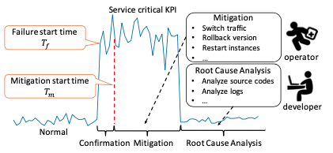

# FluxRank:一种适用于广泛部署的自动RCA框架
[点击下载原始论文](./FluxRank-paper.pdf)

索引关键词: KPI, 故障诊断, 故障定位

FluxRank使用来自顶级搜索公司的五个真实服务（具有成千上万台计算机）的历史案例进行评估，结果表明，在70例案例中，有55（66）例的根本原因机器排名第一（前三）。 与现有方法相比，FluxRank平均将本地化时间减少了80％以上。 FluxRank已在一个Internet服务和六个Banking服务上在线部署了三个月，并且正确地将根本原因机器本地化为59例中55例中的前1例。

## 1. Introduction
实践中处理系统异常分为三步：  
1. failure confirmation: 故障确认   
2. mitigation: 故障处理  
3. Root Cause Analysis: 根因分析  

在执行错误缓解系统问题之前是很难也没有必要确定系统的根因的，这是由于以下两个原因：1. 在执行缓解措施的时候，运维人员是没有确定service问题根因的必要信息的；2. 对于现在的K8S或者Mesos构架来说，单单通过机器KPI的变化所指示的机器故障足以决策如何采取缓解措施。

