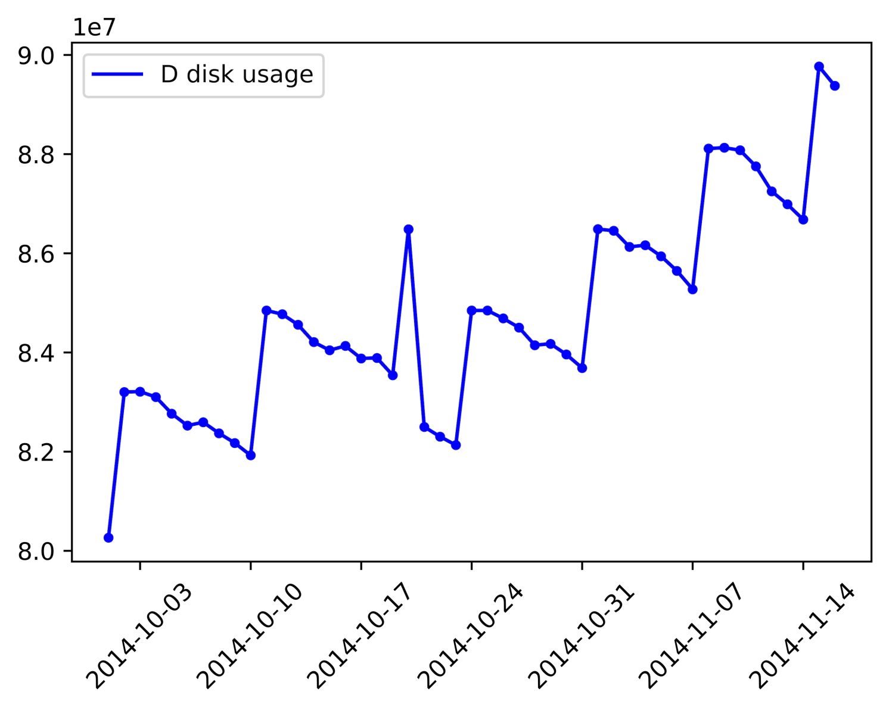
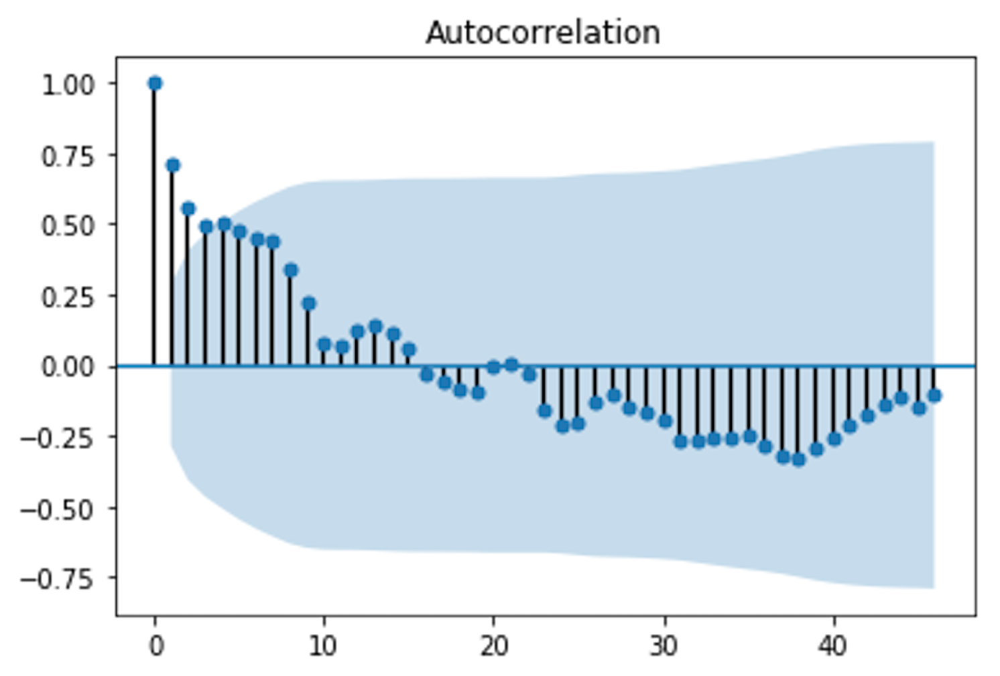

# 时序序列分析的一般步骤(完善中...)
## 1. 时序数据预处理
对于一个序列，首先要对它纯随机性和平稳性进行检验，这两个重要的检验称为序列的预处理。根据检验结果可以将序列分为不同的类型，对不同类型的序列会采取不同的分析方法。

对于纯随机序列，又称为**白噪声序列**，序列的各项之间没有任何相关关系，序列在进行完全无序的随机波动，可以终止对该序列的分析。

对于平稳非白噪声序列，它的均值和方差是常数，现已有一套非常成熟的平稳序列的建模方法。通常是建立一个线性模型来拟合该序列的发展，借此提取该序列的有用信息。ARIMA模型是常用的平稳序列拟合模型。

对于非平稳序列，由于它的均值和方差不稳定，**处理方法一般是将其转变为平稳序列**，这样就可以应用有关平稳时间序列的分析方法来进行相应的研究。

### 1.1 纯随机检验
如果一个序列是纯随机序列，那么它的序列值之间应该没有任何关系，即满足$\gamma(k)=0, k \neq 0$，$\gamma(k)$表示滞后$k$阶的自协方差函数，这是一种理论上才会出现的理想状态。

纯随机性检验也称**白噪声检验**，一般是构造检验统计量来检验序列的纯随机性，常用的检验统计量有**Q统计量、LB统计量**，由样本各延迟期数的自相关系数可以计算得到检验统计量，然后计算对应的$p$值，如果$p$值显著大于显著性水平$\alpha$，则表示该序列不能拒绝纯随机的原假设，可以停止对该序列的分析。

> Ljung-Box Q统计量用于检验某个时间段内的一系列观测值是不是随机的独立观测值。如果观测值并非彼此独立，一个观测值可能会在 k 个时间单位后与另一个观测值相关，形成一种称为自相关的关系。自相关会削减基于时间的预测模型（例如时间序列图）的准确性，并导致数据的错误解释。

> 例如，一家电子公司对电池的月销售量跟踪记录五年。他们想使用这些数据来设计一个时间序列模型，以帮助预测未来的销售额。但是，月销售额可能会受季节性趋势影响。例如，当人们为圣诞玩具购买电池时，每年这个时候的销售额都会提升。因此某一年的月销售额观测值可能会与 12 个月后（滞后为 12）的月销售额观测值相关。

> 在选择时间序列模型之前，他们可以评估月销售额差异的自相关。Ljung-Box Q (LBQ) 统计量将检验最多滞后 k 的自相关等于零的原假设（即，数据值在某一滞后数（本例中为 12）之前是随机和独立的）。如果 LBQ 大于特定临界值，则一个或多个滞后的自相关可能显著不同于零，说明在这段时间内各个值并不是独立和随机的。

>LBQ 还用于在拟合时间序列模型（例如 ARMA）后评估假设，以确保残差彼此独立。

>Ljung-Box 是一种 Portmanteau 检验，同时也是 Box-Pierce 卡方统计量的修订版。

> LB统计量与Q统计量差不多

> 对于滞后相关的检验，我们常常采用的方法还包括计算ACF和PCAF并观察其图像，但是无论是ACF还是PACF都仅仅考虑是否存在某一特定滞后阶数的相关。<font style="color:red;">LB检验则是基于一系列滞后阶数，判断序列总体的相关性或者说随机性是否存在。</font>

LB检验的原假设和备择假设分别为 ：

H0: 原本的数据都是独立的，即总体的相关系数为0，能观察到的某些相关仅仅产生于随机抽样的误差。即 $\hat{\rho_1}^2 = \hat{\rho_2}^2 = \cdots = \hat{\rho_h}^2$ ,其中h是人为给定的,有的时候我们在软件中仅仅给定一个上界,而不是具体的h。

Ha: 原本的数据不是独立的，即至少存在某个$\hat{\rho_k}^2 \neq 0$,其中$k \leq h$。

构造的统计量是：
$$Q=n(n+2)\sum_{k=1}^h \frac{\hat{\rho_k}^2}{n-k}$$
其中n是样本数量,$\hat{\rho_k}^2$是样本k阶滞后的相关系数，该统计量服从自由度为h的卡方分布。给定显著性水平$\alpha$,则拒绝域是$Q>\chi^2_{1-\alpha,h}$。接受原假设意味着，认为原序列是白噪声序列，否则认为序列存在相关性。

使用 [statsmodels.stats.diagnostic.acorr_ljungbox](https://www.statsmodels.org/devel/generated/statsmodels.stats.diagnostic.acorr_ljungbox.html) 可以方便的对时序数据进行白噪声检验。

```python
def acorr_ljungbox(x, lags=None, boxpierce=False, model_df=0, period=None, return_df=None, auto_lag=False)

"""
Ljung-Box test of autocorrelation in residuals.

参数
	x: 用于检验的时间序列. The data is demeaned before the test statistic is computed.
  
	lags：{int, array_like}, default None.整数一般取 int(ln(len(x))),即以e为底序列长的对数取整 	If lags is an integer then this is taken to be the largest lag that is included, the test result is reported for all smaller lag length. If lags is a list or array, then all lags are included up to the largest lag in the list, however only the tests for the lags in the list are reported. If lags is None, then the default maxlag is currently min((nobs // 2 - 2), 40). After 0.12 this will change to min(10, nobs // 5). The default number of lags changes if period is set.
  	
	boxpierce:bool, default False. If true, then additional to the results of the Ljung-Box test also the Box-Pierce test results are returned.

	model_df:int, default 0. Number of degrees of freedom consumed by the model. In an ARMA model, this value is usually p+q where p is the AR order and q is the MA order. This value is subtracted from the degrees-of-freedom used in the test so that the adjusted dof for the statistics are lags - model_df. If lags - model_df <= 0, then NaN is returned.

	period:int, default None. The period of a Seasonal time series. Used to compute the max lag for seasonal data which uses min(2*period, nobs // 5) if set. If None, then the default rule is used to set the number of lags. When set, must be >= 2.

	return_df: bool, default None. Flag indicating whether to return the result as a single DataFrame with columns lb_stat, lb_pvalue, and optionally bp_stat and bp_pvalue. After 0.12, this will become the only return method. Set to True to return the DataFrame or False to continue returning the 2 - 4 output. If None (the default), a warning is raised.

	auto_lag:bool, default False. Flag indicating whether to automatically determine the optimal lag length based on threshold of maximum correlation value.

Returns
	lbvalue:float or array,The Ljung-Box test statistic. 测试结果
	
    pvalue:float or array. The p-value based on chi-square distribution. The p-value is computed as 1.0 - chi2.cdf(lbvalue, dof) where dof is lag - model_df. If lag - model_df <= 0, then NaN is returned for the pvalue. 基于卡方分布的p值
	
    bpvalue(optional), float or array. The test statistic for Box-Pierce test. Box-Pierce测试的测试统计
	
    bppvalue(optional), float or array. The p-value based for Box-Pierce test on chi-square distribution. The p-value is computed as 1.0 - chi2.cdf(bpvalue, dof) where dof is lag - model_df. If lag - model_df <= 0, then NaN is returned for the pvalue.基于卡方分布的Box-Pierce测试的p值
"""
```

以下代码展示使用LB统计量检验原始序列和一阶差分序列是否为白噪声序列。在LB统计量检验中，假设原始序列为白噪声序列，当存在p值大于置信水平时，不能拒绝原假设，即原始序列为白噪声序列。

```python
import pandas as pd
import numpy as np

change_data = pd.read_excel('/Users/Mac/Desktop/change_discdata.xls')
data = change_data.iloc[:len(change_data)-5]

from statsmodels.stats.diagnostic import acorr_ljungbox
[lb, p] = acorr_ljungbox(data['CWXT_DB:184:D'], lags=int(np.log(len(data))))
h = (p < 0.05).sum()
if h > 0:
    print('原始序列为非白噪声序列')
else:
    print('原始序列为白噪声序列')

[ld1, p1] = acorr_ljungbox(data['CWXT_DB:184:C'].diff().dropna(), lags=int(np.log(len(data))))
h1 = (p1 < 0.05).sum()
if h1 > 0:
    print('一阶差分序列为非白噪声序列')
else:
    print('一阶差分序列为白噪声序列')
    
#结果打印
>>> 原始序列为非白噪声序列
>>> 一阶差分序列为白噪声序列
```

### 1.2 平稳性检验
**什么是平稳序列？如果时间序列$X_t, t \in T$ 在某一常数附近波动且波动范围有限，即有常数均值和常数方差，并且延迟$k$期的序列变量的自协方差和自相关系数是相等的或者说延迟$k$期的序列变量之间的影响程度是一样的，则称为$X_t, t \in T$平稳序列。**

对于序列的平稳性检验有两种检验方法:  
1. <font style="color:red;">根据时序图和自相关图的特征作出判断的图检验，该方法操作简单、应用广泛，缺点是带有主观性;</font> 
2. <font style="color:red;">另一种是构造检验统计量进行检验的方法，目前最常用的是单位根检验；</font> 

> 平稳的时间序列的性质不随观测时间的变化而变化。因此具有趋势或季节性的时间序列不是平稳时间序列——趋势和季节性使得时间序列在不同时段呈现不同性质。与它们相反，白噪声序列（white noise series）则是平稳的——不管观测的时间如何变化，它看起来都应该是一样的。

> <font style="color:red;">在判断平稳性上，下面这个例子容易让人混淆：如果一个循环变化的时间序列没有趋势和季节性，那么它仍然是平稳的。这是因为这些循环变化并没有一个固定的周期，因此在进行观测之前我们无法知道循环变化的峰值和谷值会出现在哪个位置。</font>

#### 1.2.1 时序图检验
根据平稳时间序列的均值和方差都为常数的性质，**平稳序列的时序图显示该序列值始终在一个常数附近随机波动，而且拨动范围有界；如果有明显的趋势性或周期性，那它通常不是平稳序列**.下图展示一个磁盘的使用量随时间变化的时序图：

```python
import matplotlib.pyplot as plt
import pandas as pd

change_data = pd.read_excel('/Users/Mac/Desktop/change_discdata.xls')
change_data = change_data.set_index('COLLECTTIME')
d_data = change_data['CWXT_DB:184:D']
x = change_data.index
plt.figure(dpi=1024)
plt.plot(x, d_data, 'b', label='D disk usage')
plt.xticks(rotation=45)
plt.legend(loc='upper left')
plt.scatter(x, d_data, 10, color='blue')
plt.show()
```


#### 1.2.2 自相关性检验

<font style="color:red;">平稳序列具有短期相关性，这个性质表明对平稳序列而言通常只有近期的序列值对现时值的影响比较明显，间隔越远的现实值对现实值的影响越小。随着延迟期数$k$的增加，平稳序列的自相关系数$\rho_k$会比较快的衰减趋向于零，并在零附近随机波动，而非平稳序列的自相关系数衰减的比较慢，这就是利用自相关图进行平稳性检验的标准。</font>

```python
import pandas as pd

data = pd.read_excel('/Users/Mac/Desktop/change_discdata.xls')
from statsmodels.graphics.tsaplots import plot_acf
plot_acf(data['CWXT_DB:184:D'])
```


#### 1.2.3 单位根检验
单位根检验是指检验序列中是否存在单位根，如果存在单位根就是非平稳时间序列。在python中常用的单位根检验的工具是 [statsmodels.tsa.stattools.adfuller](https://www.statsmodels.org/stable/generated/statsmodels.tsa.stattools.adfuller.html) ，即<font style="color:red">**ADF检验**</font>。

```python
statsmodels.tsa.stattools.adfuller(x, maxlag=None, regression='c', autolag='AIC', store=False, regresults=False)
"""
Augmented Dickey-Fuller unit root test.

The Augmented Dickey-Fuller test can be used to test for a unit root in a univariate process in the presence of serial correlation.
"""
```
以下代码展示使用ADF检验序列是否存在单位根，如果存在表明序列为非平稳序列，随后对其进行差分运算，直到变为平稳序列。ADF检验的原假设为序列存在单位根，当测试结果小于5%的临界值或者p值小于0.05的显著性水平时表明可以拒绝原假设，小于1%的临界值时极其显著地拒绝原假设。

```python
import pandas as pd

change_data = pd.read_excel('/Users/Mac/Desktop/change_discdata.xls')
data = change_data.iloc[:len(change_data) - 5]

from statsmodels.tsa.stattools import adfuller as ADF

d = 0
adf = ADF(data['CWXT_DB:184:D'])
print('原始序列单位根检验结果：')
print(adf)
while adf[1] >= 0.05:
    d += 1
    adf = ADF(data['CWXT_DB:184:C'].diff(d).dropna())
print('%s阶差分后序列单位根检验结果：' % d)
print(adf)

#打印结果
原始序列单位根检验结果：
(-2.6460462274942982, 0.083848896341219614, 0, 41, {'1%': -3.6009833671885199, '5%': -2.9351348158036012, '10%': -2.6059629803688282}, 958.70113211750595)
1阶差分后序列单位根检验结果：
(-5.6569392821447106, 9.5729755923330725e-07, 2, 38, {'1%': -3.6155091011809297, '5%': -2.9412623574865142, '10%': -2.6091995013850418}, 837.33354704864507)
```

## 2. 建立时间序列模型
这里主要讨论非平稳序列时间模型。对于非平稳时间序列模型，最常见的就是ARIMA模型，它是差分运算和ARMA模型的组合，其中ARMA模型主要用于平稳时间序列。前面的例子已经展示如何通过运算将非平稳序列转化为平稳序列，转化后的序列可以使用ARMA模型进行拟合。

### 2.1 ARMA模型
具有以下结构的模型称为自回归移动平均模型，简记为ARMR(p, q):  
$$x_t = \phi_0 + \phi_1 x_{t-1} + \phi_2 x_{t-2} + \cdots + \phi_p x_{t-p} + \epsilon_t -\theta_1 \epsilon_{t-1} - \theta_2 \epsilon_{t-2} - \cdots - \theta_q \epsilon_{t-q}$$

即在时刻的随机变量$X_t$的取值$x_t$是前$p$期和前q期$\epsilon_{t-1},\epsilon_{t-2},\cdots,\epsilon_{t-q}$的多元线性函数，误差项是当期的随机干扰$\epsilon_t$，为零均值白噪声序列。认为$x_t$主要是受过去$p$期的序列值和过去的$q$期的误差项共同影响的。

接下来是要对模型进行定阶，定阶过程其实就是确定p和q。有两种方法确定p和q：  
**第一种：人为识别。观察序列模型的自相关系数和偏相关系数。自相关系数显示p借拖尾，偏相关系数显示q阶拖尾，此时的p和q即是我们要找的。**  
**第二种：相对最优模型识别。取一系列p和q的取值范围，通常取0到序列长的0.1倍，观察所有的p,q组合的BIC信息量，选取信息量最小的那组p,q，以下是具体的操作:**

```python
import pandas as pd
change_data = pd.read_excel('/Users/Mac/Desktop/change_discdata.xls')
data = change_data.iloc[:len(change_data)-5]
data = data.set_index('COLLECTTIME')
from statsmodels.tsa.arima_model import ARIMA
pmax = int(len(data) / 10)
qmax = int(len(data) / 10)
bic_matrix = []
for p in range(pmax):
    tmp = []
    for q in range(qmax):
        try:
            tmp.append(ARIMA(data['CWXT_DB:184:D'], (p, 1, q)).fit().bic)
        except:
            tmp.append(None)
    bic_matrix.append(tmp)
bic_matrix = pd.DataFrame(bic_matrix)
print('p, q组合的BIC信息量矩阵：')
print(bic_matrix)
p, q = bic_matrix.stack().idxmin()
print('BIC信息量最小的p，q值：')
print('p=%s, q=%s' %(p, q))
#打印结果
p, q组合的BIC信息量矩阵：
             0            1            2            3
0  1275.686824  1273.190435  1272.928341  1276.827800
1  1276.749128  1271.909634          NaN          NaN
2  1279.694296  1275.602510          NaN  1280.092482
3  1278.065999  1278.988595  1282.782535  1285.943494
BIC信息量最小的p, q值：
p=1, q=1
```
跟第一种结果一致。因为原始序列是非平稳的，此处使用的是ARIMA模型，经过一阶差分后成为平稳序列，因而程序中ARIMA模型中的第二个参数(p, d, q)的d=1

## 3. 模型的检验、预测和评价
### 3.1 模型检验
上一步确定的模型为ARIMA(1, 1, 1), 确定后需要检验残差是否为白噪声，如果不是白噪声，说明残差中还存在有用信息，需要修改模型或进一步提取。
```python
import pandas as pd
import numpy as np
import matplotlib.pyplot as plt

change_data = pd.read_excel('/Users/Mac/Desktop/change_discdata.xls')
data = change_data.iloc[:len(change_data) - 5] #最后5行数据不用于训练
data = data.set_index('COLLECTTIME')

from statsmodels.tsa.arima_model import ARIMA
from statsmodels.stats.diagnostic import acorr_ljungbox

arima = ARIMA(data['CWXT_DB:184:D'], (1, 1, 1)).fit() #训练已经确定的模型
x_predict = arima.predict(typ='levels')
pred_error = (x_predict - data['CWXT_DB:184:D']).dropna() #残差
lb, p = acorr_ljungbox(pred_error, lags=int(np.log(len(pred_error)))) #对残差进行白噪声检验
h = (p < 0.05).sum()
if h > 0:
    print('模型ARIMA(1, 1, 1)的残差不符合白噪声检验')
else:
    print('模型ARIMA(1, 1, 1)的残差符合白噪声检验')
    
# 打印结果
模型ARIMA(1, 1, 1)的残差符合白噪声检验
```
### 3.2 模型预测
```python
import pandas as pd
import numpy as np

change_data = pd.read_excel('/Users/Mac/Desktop/change_discdata.xls')
data = change_data.iloc[:len(change_data) - 5]
data = data.set_index('COLLECTTIME')

from statsmodels.tsa.arima_model import ARIMA
from statsmodels.stats.diagnostic import acorr_ljungbox

arima = ARIMA(data['CWXT_DB:184:D'], (1, 1, 1)).fit() #模型训练
predict_value = arima.predict('2014-11-12', '2014-11-16', dynamic='True', typ='levels') #模型预测
true_value = change_data.iloc[len(change_data) - 5:].set_index('COLLECTTIME')['CWXT_DB:184:D']
pre_data = pd.concat([true_value, predict_value], axis=1)
pre_data.columns = ['true_value_D', 'predict_value_D']
print(pre_data)
#pre_data.to_excel('/Users/Mac/Desktop/pre_data.xls')

#打印结果           
COLLECTTIME   true_value_D   predict_value_D                        
2014-11-12    87249335.55     8.741129e+07
2014-11-13    86986142.20     8.734455e+07
2014-11-14    86678240.00     8.739133e+07
2014-11-15    89766600.00     8.748490e+07
2014-11-16    89377527.25     8.759774e+07
```
### 3.3 模型评价
对该模型采用3个统计量指标进行评价：平均绝对误差、均方根误差和平均绝对百分误差。由于实验数据是磁盘容量大小，原数据采用kb为单位，模型评价部分将其转化为Gb为单位。

```python
import pandas as pd

pre_data = pd.read_excel('/Users/Mac/Desktop/pre_data.xls')
pre_value = pre_data['predict_value_D']
true_value = pre_data['true_value_D']
change_value = 1024*1024

abs_ = (pre_value - true_value).abs()
mae_ = abs_.mean()
rmse_ = ((abs_**2).mean())**0.5
mape_ = (abs_/true_value).mean()

print('平均绝对误差：%0.4f.\n均方根误差：%0.4f.\n平均绝对百分误差：%0.4f.'%(mae_/change_value, rmse_/change_value, mape_*100))

#打印结果
平均绝对误差：1.0094.
均方根误差：1.2831.
平均绝对百分误差：1.1901.
```

## 4. 总结
时间序列分析的整个过程大致分为以下几步：
1. **首先进行平稳性检查，如果序列不平稳则对序列进行差分运算，将其转化为平稳序列。**
2. **对转化后的平稳序列采用ARIMA模型拟合并利用BIC信息准则确定p,q, 最终确定ARIMA(p, d, q)模型**
3. **对确定后的模型残差进行白噪声检验，如果模型通过检验，采用模型进行预测，并对预测结果进行评价；如果模型没有通过白噪声检验，返回第2部重新优化模型。**