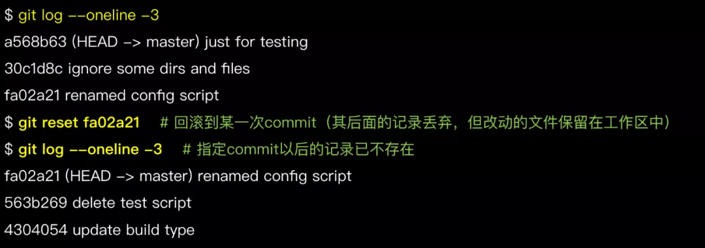
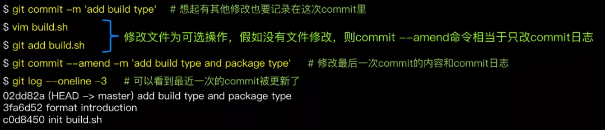
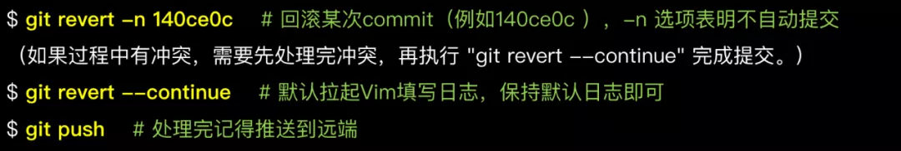
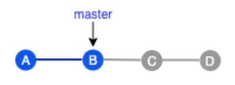
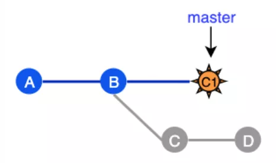
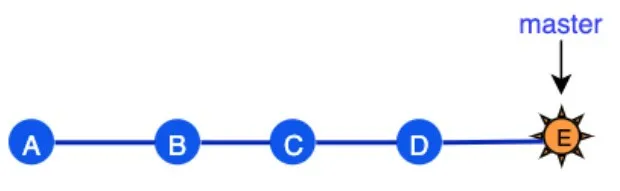
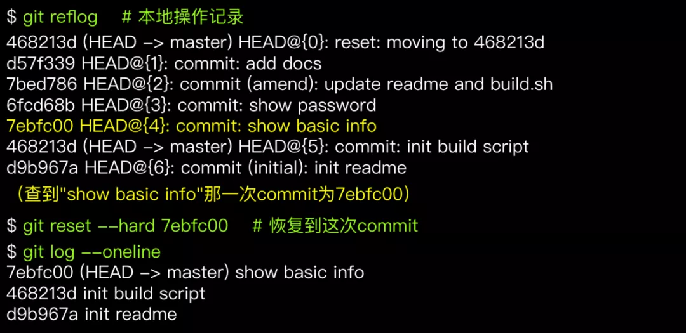
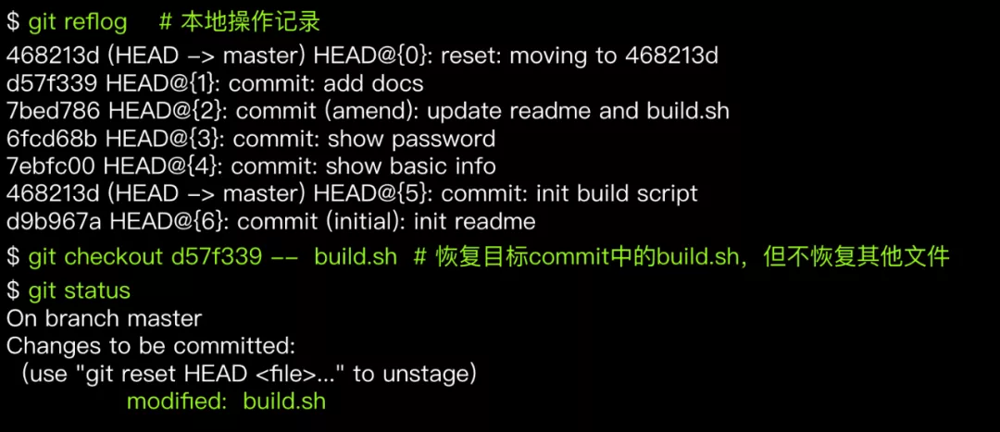
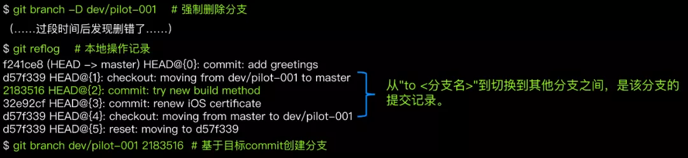
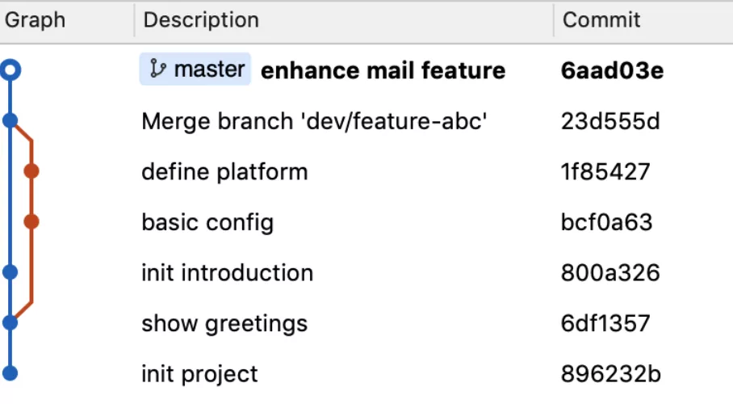

# Git 代码回滚与找回的艺术
常见的代码回滚场景

## 1. Git回滚
### 1.1 回滚场景：仅在工作区修改时
当文件在工作区修改，还没有提交到暂存区和本地仓库时，可以用 `git checkout -- 文件名`来回滚这部分修改。  
不过需要特别留意的是**这些改动没有提交到 Git 仓库，Git 无法追踪其历史，一旦回滚就直接丢弃了。**  


```shell
git checkout -- build.sh
```

### 1.2 回滚场景：已添加到暂存区时 
即执行过 `git add` 添加到暂存区，但还没 commit，这时可以用 `git reset HEAD 文件名`回滚。通过`git status`可以看到相关提示:  


执行以下命令回滚暂存区的修改： `git reset HEAD build.sh`

回滚后工作区会保留该文件的改动，可重新编辑再提交，或者 `git checkout -- 文件名` 彻底丢弃修改。

### 1.3 回滚场景：已 commit，但还没有 push 时
即已经提交到本地代码库了，不过还没有 push 到远端。这时候可用 `git reset`命令，命令格式为：   

`git  reset  <要回滚到的 commit>` 或者 `git  reset  --hard  <要回滚到的 commit>`

**需注意的是，提供的是要回滚到的 commit，该 commit 之后的提交记录会被丢弃。**



`git reset` 默认会将被丢弃的记录所改动的文件保留在工作区中，以便重新编辑和再提交。加上 `--hard` 选项则不保留这部分内容，需谨慎使用。   

### 1.4 回滚场景：修改本地最近一次 commit

有时 commit 之后发现刚才没改全，想再次修改后仍记录在一个 commit 里。利用 "git reset" 可达到这个目的，不过，Git 还提供了更简便的方法来修改最近一次 commit。
 
命令格式如下： 

`git  commit --amend  [ -m <commit说明> ]`

如果命令中不加`-m <commit说明>`部分，则 Git 拉起编辑器来输入日志说明。  



**请注意，"git commit --amend" 只可用于修改本地未 push 的 commit，不要改动已 push 的 commit！**

### 1.5 回滚场景：已 push 到远端时

**注意！此时不能用 "git reset"，需要用 "git revert"！**  
**注意！此时不能用 "git reset"，需要用 "git revert"！**  
**注意！此时不能用 "git reset"，需要用 "git revert"！**  

是因为 "git reset" 会抹掉历史，用在已经 push 的记录上会带来各种问题；而 "git revert" 用于回滚某次提交的内容，并生成新的提交，不会抹掉历史。 

 命令 | 是否抹除历史 | 适用场景
 :--------: |  :--------: |  :--------: 
 git reset | 是，回滚的历史将消除 | 本地未push的记录
 git revert | 否，历史记录保留，回滚后重新生成提交记录 | 回滚已push的内容



过程中如果遇到问题（如处理冲突时搞乱了），可用 `git revert --abort` 取消本次回滚行为。  

> 如果要回滚的是一个合并 commit，revert 时要加上"-m <父节点序号>"，指定回滚后以哪个父节点的记录作为主线。合并的 commit 一般有 2 个父节点，按 1、2 数字排序，对于要回滚“分支合入主干的 commit”，常用"-m 1"，即用主干记录作为主线。 回滚合并 commit 是一个较为复杂的话题，作为一般性建议，应避免回滚合并 commit。对该话题感兴趣的可进一步了解：  
>(https://github.com/git/git/blob/master/Documentation/howto/revert-a-faulty-merge.txt)

## 2. reset与revert对比
- 分支初始状态如下：   


- 如果执行 `git reset B `, 工作区会指向 B，其后的提交（C、D）被丢弃。  


此时如果做一次新提交生成 C1，C1 跟 C、D 没有关联。 



- 如果执行 `git revert B `, 回滚了 B 提交的内容后生成一个新 commit E，原有的历史不会被修改。



## 3. 找回已删除的内容
"git reflog"是恢复本地历史的强力工具，几乎可以恢复所有本地记录，例如被 reset 丢弃掉的 commit、被删掉的分支等，称得上代码找回的“最后一根救命稻草”。
 
然而需要注意，并非真正所有记录"git reflog"都能够恢复，有些情况仍然无能为力： 

1. 非本地操作的记录

"git reflog"能管理的是本地工作区操作记录，非本地（如其他人或在其他机器上）的记录它就无从知晓了。  

2. 未 commit 的内容

例如只在工作区或暂存区被回滚的内容（`git checkout -- 文件` 或 `git reset HEAD 文件`）。

3. 太久远的内容

"git reflog"保留的记录有一定时间限制（默认 90 天），超时的会被自动清理。另外如果主动执行清理命令也会提前清理掉。

### 3.1 reflog - 恢复到特定 commit 

一个典型场景是执行 reset 进行回滚，之后发现回滚错了，要恢复到另一个 commit 的状态。  


我们通过`git reflog`查看 commit 操作历史，找到目标 commit，再通过 reset 恢复到目标 commit。



通过这个示例我们还可以看到清晰、有意义的 commit log 非常有帮助。假如 commit 日志都是"update"、"fix"这类无明确意义的说明，那么即使有"git reflog"这样的工具，想找回目标内容也是一件艰苦的事。

### 3.2 reflog - 恢复特定 commit 中的某个文件 
场景：执行 reset 进行回滚，之后发现丢弃的 commit 中部分文件是需要的。

解决方法：通过 reflog 找到目标 commit，再通过以下命令恢复目标 commit 中的特定文件。

```shell
git  checkout  <目标 commit>  -- <文件>
```

示例:
reset 回滚到 commit 468213d 之后，发现原先最新状态中（即 commit d57f339）的 build.sh 文件还是需要的，于是将该文件版本单独恢复到工作区中。 



### 3.3 reflog - 找回本地误删除的分支
场景：用"git branch -D"删除本地分支，后发现删错了，上面还有未合并内容！

解决方法：通过 reflog 找到分支被删前的 commit，基于目标 commit 重建分支。

```
git  branch  <分支名>  <目标commit>
```

reflog 记录中，"to <分支名>"（如 moving from master to dev/pilot-001） 到切换到其他分支（如 moving from dev/pilot-001 to master）之间的 commit 记录就是分支上的改动，从中选择需要的 commit 重建分支。



### 3.4 找回合流后删除的分支
> 作为 Git 优秀实践之一，开发分支合流之后即可删掉，以保持代码库整洁，只保留活跃的分支。 

> 一些同学合流后仍保留着分支，主要出于“分支以后可能还用得到”的想法。其实大可不必，已合入主干的内容不必担心丢失，随时可以找回，包括从特定 commit 重建开发分支。并且，实际需要用到旧开发分支的情况真的很少，一般来说，即使功能有 bug，也是基于主干拉出新分支来修复和验证。

假如要重建已合流分支，可通过主干历史找到分支合并记录，进而找到分支节点，基于该 commit 新建分支，例如： 

```
git  branch  dev/feature-abc  1f85427
```



## 4. 关于代码回滚的一些建议
命令 | 特点 | 建议
:------: | :------: | :------:
`git checkout -- 文件` | 回滚本地工作区未暂存的改动，被丢弃的内容不可恢复 | 操作前务必确认要回滚的改动是不再需要的
`git reset HAED 文件` | 回滚暂存区的文件改动 | 一般不加`--hard`选项
`git reset <commit>` | 回滚到目标commit，丢弃掉commit之后的提交记录，将被丢弃记录所做的改动保留在工作区 | 1. 只操作本地记录，禁止操作已push的记录； 2. 慎用 `--hard`选项
`git commit --amend` | 修改最后一次commit的内容和提交日志 | 只操作本地记录，禁止操作已push的记录
`git revert <commit>` | 回滚相关commit所做的改动，再次提交将生成新的commit，历史记录不受影响 | 已push的内容如果回滚并使用revert

总体来讲，回滚要谨慎，不要过于依赖回滚功能，避免使用"git push -f", **如果用到"git push -f"，你肯定哪里做错了！**

